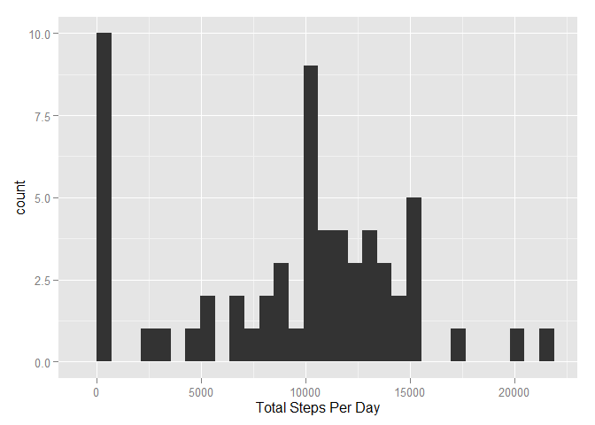
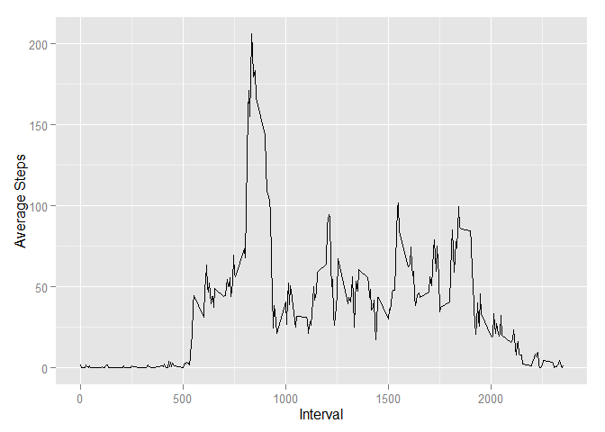
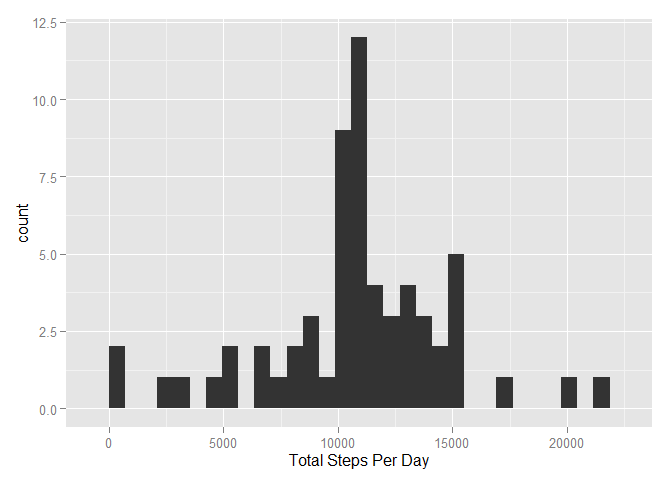
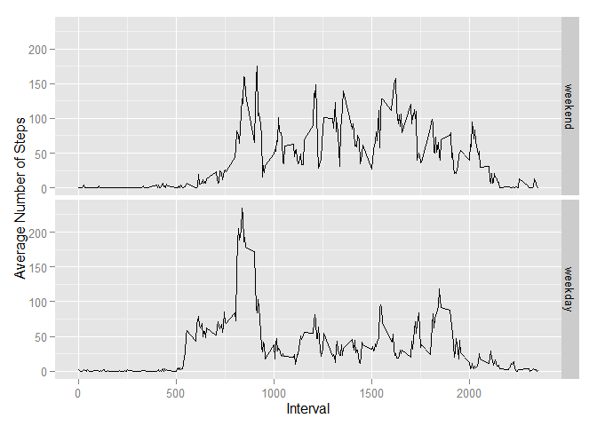

# PA1_template
Bing  
14 July 2015  

#Loading and preprocessing the data:

```r
data <- read.csv("activity.csv")
data[,2] <- as.POSIXct(as.character(data$date), format="%Y-%m-%d") 
head(data)
```

```
##   steps       date interval
## 1    NA 2012-10-01        0
## 2    NA 2012-10-01        5
## 3    NA 2012-10-01       10
## 4    NA 2012-10-01       15
## 5    NA 2012-10-01       20
## 6    NA 2012-10-01       25
```

```r
str(data)
```

```
## 'data.frame':	17568 obs. of  3 variables:
##  $ steps   : int  NA NA NA NA NA NA NA NA NA NA ...
##  $ date    : POSIXct, format: "2012-10-01" "2012-10-01" ...
##  $ interval: int  0 5 10 15 20 25 30 35 40 45 ...
```

#What is mean total number of steps taken per day?
Ignore the missing values in the dataset 

Calculate the total number of steps taken per day

```r
total_steps <- aggregate(data$steps, by=list(data$date), FUN=sum, na.rm=TRUE)
total_steps[,1] <- as.POSIXct(as.character(total_steps$Group.1), 
                              format="%Y-%m-%d") 
names(total_steps) <- c("Date", "x")
```

Make a histogram of the total number of steps taken each day

```r
library(ggplot2)
```

```
## Warning: package 'ggplot2' was built under R version 3.1.3
```

```r
qplot(x, data=total_steps, geom="histogram", xlab = "Total Steps Per Day")
```

```
## stat_bin: binwidth defaulted to range/30. Use 'binwidth = x' to adjust this.
```

 

Calculate & report the mean & median of total number of steps per day

```r
mean(total_steps$x)
```

```
## [1] 9354.23
```

```r
median(total_steps$x)
```

```
## [1] 10395
```

#What is the average daily activity pattern?
Make a time series plot (i.e. type = "l") of the 5-minute interval (x-axis) 
and the average number of steps taken, averaged across all days (y-axis)

```r
ave_steps <- aggregate(data$steps, by=list(data$interval), FUN=mean, na.rm=TRUE)
names(ave_steps) <- c("Interval", "x")
qplot(Interval, x, data=ave_steps, geom="line", ylab = "Average Steps")
```

 

Which 5-minute interval, on average across all the days in the dataset, 
contains the maximum number of steps?

```r
max_steps = subset(ave_steps, ave_steps$x==max(ave_steps$x)) 
paste(as.character(max_steps[,1]),"- 840")
```

```
## [1] "835 - 840"
```

#Imputing missing values
Calculate and report the total number of missing values in the dataset 
(i.e. the total number of rows with NAs)

```r
sum(is.na(data$steps))
```

```
## [1] 2304
```

Devise a strategy for filling in all of the missing values in the dataset. 
E.g, you could use the mean for that 5-minute interval.

Create a new dataset that is equal to the original dataset but with the 
missing data filled in.

```r
new_data <- data
for(i in 1:nrow(data)) {
    if(is.na(data[i,1])) {
        interv <- data[i,3]
        for(k in 1:nrow(ave_steps)) {
            if(ave_steps[k,1]==interv) { repl <- ave_steps[k,2] }
        }
        new_data[i,1] <- repl
    }
}
```

Make a histogram of the total number of steps taken each day 

```r
new_total_steps <- aggregate(new_data$steps, by=list(new_data$date), 
                             FUN=sum, na.rm=TRUE)
new_total_steps[,1] <- as.POSIXct(as.character(new_total_steps$Group.1), 
                                  format="%Y-%m-%d") 
names(new_total_steps) <- c("Date", "x")
qplot(x, data=new_total_steps, geom="histogram", xlab = "Total Steps Per Day")
```

```
## stat_bin: binwidth defaulted to range/30. Use 'binwidth = x' to adjust this.
```

 

Calculate & report the mean and median total number of steps taken per day

```r
mean(new_total_steps$x)
```

```
## [1] 10766.19
```

```r
median(new_total_steps$x)
```

```
## [1] 10766.19
```

#Do these values differ from the estimates in the first part of the assignment? 
What is the impact of imputing missing data on the estimates 
of the total daily number of steps?

```r
mean(new_total_steps$x) - mean(total_steps$x)
```

```
## [1] 1411.959
```

```r
median(new_total_steps$x) - median(total_steps$x)
```

```
## [1] 371.1887
```

#Are there differences in activity patterns between weekdays and weekends?
Use the dataset with the filled-in missing values for this part.

Create a new factor variable with two levels: “weekday” and “weekend” 

```r
data$days <- factor((weekdays(new_data$date) %in% c("Sunday","Saturday")), 
               levels = c(TRUE,FALSE), labels=c("weekend", "weekday"))
```
              
Make a panel plot containing a time series plot (i.e. type = "l") 
of the 5-minute interval (x-axis) and the average number of steps taken, 
averaged across all weekday days or weekend days (y-axis). 

```r
new_ave_steps <- aggregate(data$steps, by=list(data$interval,data$days), 
                           FUN=mean, na.rm=TRUE)
names(new_ave_steps) <- c("Interval", "Day", "x")
qplot(Interval, x, data=new_ave_steps, geom="line", facets = Day ~ ., 
      ylab = "Average Number of Steps")
```

 

